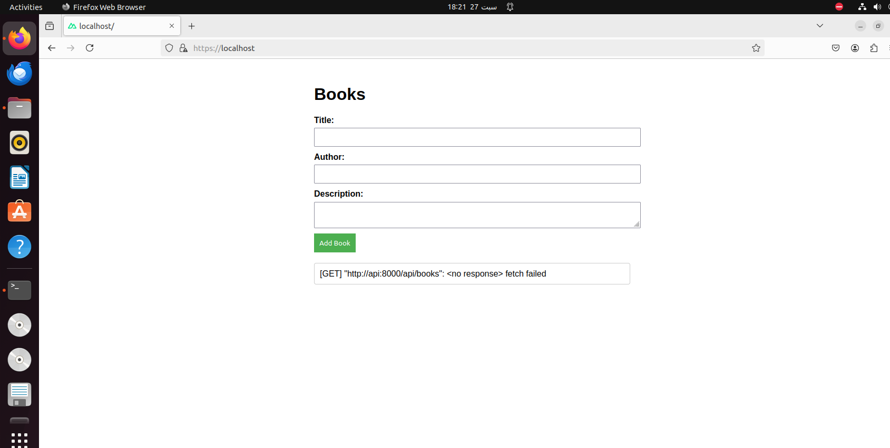
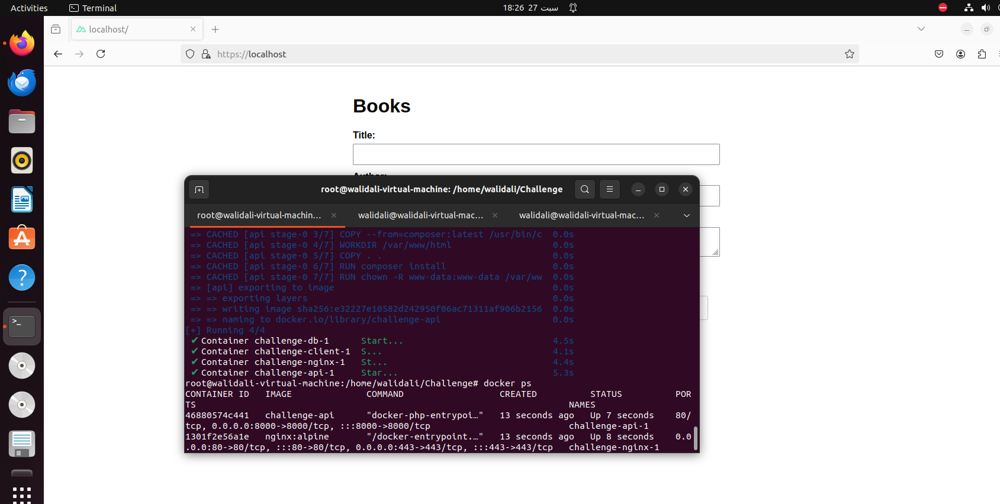
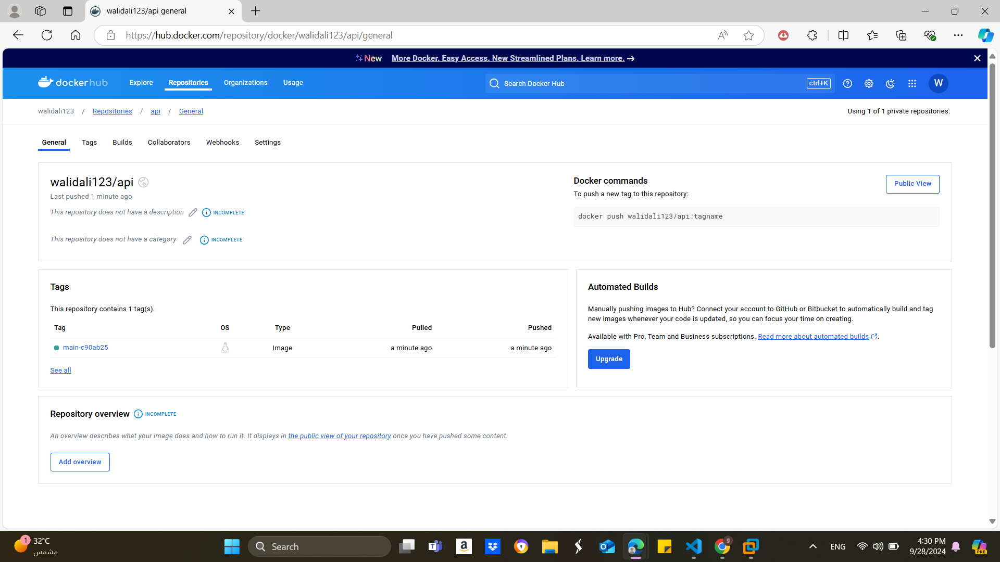
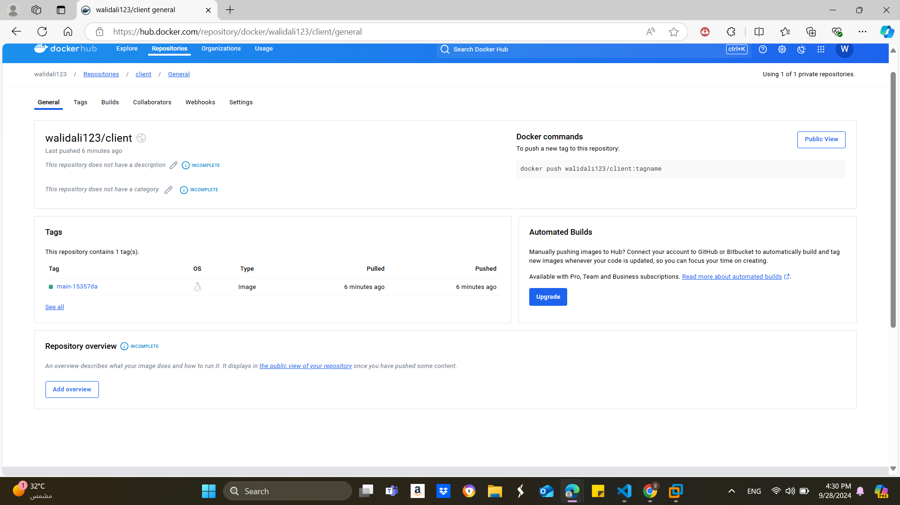
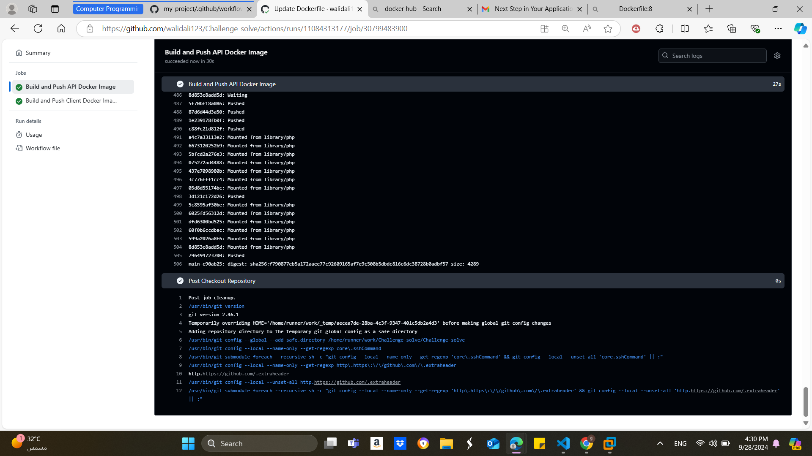

# Docker Compose Environment for Laravel API, Nuxt.js, MySQL, and Nginx

This project demonstrates how to set up a multi-container Docker environment with MySQL, a Laravel API, a Nuxt.js client, and Nginx as a reverse proxy using Docker Compose.

## Prerequisites

Before you begin, ensure you have the following installed:

- [Docker](https://docs.docker.com/get-docker/)
- [Docker Compose](https://docs.docker.com/compose/install/)
- [OpenSSL](https://www.openssl.org/) (to generate SSL certificates)

## Services Overview

1. **MySQL (db):** The database service using MySQL 8.
2. **Laravel API (api):** The backend API service built with Laravel.
3. **Nuxt.js Client (client):** The frontend application built with Nuxt.js.
4. **Nginx (nginx):** Acts as a reverse proxy for the Nuxt.js frontend, handling both HTTP and HTTPS traffic.

## Project Structure
. ├── api # Laravel API codebase ├── client # Nuxt.js client codebase ├── certs # Directory to hold SSL certificates ├── nginx.conf # Nginx configuration file └── docker-compose.yml # Docker Compose configuration file

# Create a directory for certificates if it doesn't exist
mkdir -p ./certs

# Generate a private key
openssl genrsa -out ./certs/self-signed.key 2048

# Generate a self-signed certificate
openssl req -new -x509 -key ./certs/self-signed.key -out ./certs/self-signed.crt -days 365 -subj "/C=US/ST=State/L=City/O=Organization/OU=Unit/CN=localhost"


# Nuxt.js Application with Nginx Proxy

## Application Overview
This is a Nuxt.js application running behind an Nginx proxy using Docker Compose.

## Screenshots

### Application Running


### Docker-compose Response



# CI/CD Pipeline for Docker Images

This repository contains a GitHub Actions CI/CD pipeline that automatically builds and pushes Docker images for both the API and Client applications to Docker Hub whenever changes are pushed to the `main` branch.

## Pipeline Overview

The pipeline consists of two jobs:

1. **Build and Push API Docker Image**
2. **Build and Push Client Docker Image**

### Steps to Set Up the Pipeline

1. **Create a New GitHub Repository**
   - Go to GitHub and create a new repository.

2. **Clone the Repository**
   - Clone the repository to your local machine:
     ```bash
     git clone https://github.com/your-username/repository-name.git
     cd repository-name
     ```

3. **Create Dockerfiles**
   - Place your `Dockerfile` for the API in the `api` directory and the `Dockerfile` for the Client in the `client` directory.

4. **Create GitHub Secrets**
   - Navigate to your repository on GitHub, go to `Settings`, then `Secrets and variables`, and add the following secrets:
     - `DOCKER_USERNAME`: Your Docker Hub username.
     - `DOCKER_PASSWORD`: Your Docker Hub password.

5. **Create the GitHub Actions Workflow**
   - In the root of your repository, create a directory named `.github/workflows` if it doesn't already exist.
   - Inside the `workflows` directory, create a new file named `ci-cd.yml` and add the following content:
     ```yaml
     name: Build and Push Docker Images

     on:
       push:
         branches:
           - main

     jobs:
       build-api:
         name: Build and Push API Docker Image
         runs-on: ubuntu-latest

         steps:
         - name: Checkout Repository
           uses: actions/checkout@v2

         - name: Build and Push API Docker Image
           uses: mr-smithers-excellent/docker-build-push@v5
           with:
             image: walidali123/api
             dockerfile: ./api/Dockerfile
             directory: ./api  
             registry: docker.io
             username: ${{ secrets.DOCKER_USERNAME }}
             password: ${{ secrets.DOCKER_PASSWORD }}

       build-client:
         name: Build and Push Client Docker Image
         runs-on: ubuntu-latest

         steps:
         - name: Checkout Repository
           uses: actions/checkout@v2

         - name: Build and Push Client Docker Image
           uses: mr-smithers-excellent/docker-build-push@v5
           with:
             image: walidali123/client
             dockerfile: ./client/Dockerfile
             directory: ./client  
             registry: docker.io
             username: ${{ secrets.DOCKER_USERNAME }}
             password: ${{ secrets.DOCKER_PASSWORD }}
     ```

6. **Push Changes to GitHub**
   - After creating the workflow file, commit your changes and push them to the `main` branch:
     ```bash
     git add .
     git commit -m "Set up CI/CD pipeline for Docker images"
     git push origin main
     ```

7. **Verify the Pipeline**
   - Navigate to the `Actions` tab of your GitHub repository to see the pipeline in action. It will trigger on every push to the `main` branch.

## Screenshots


### API Image


### Client Image


### GitHub Actions Pipeline



